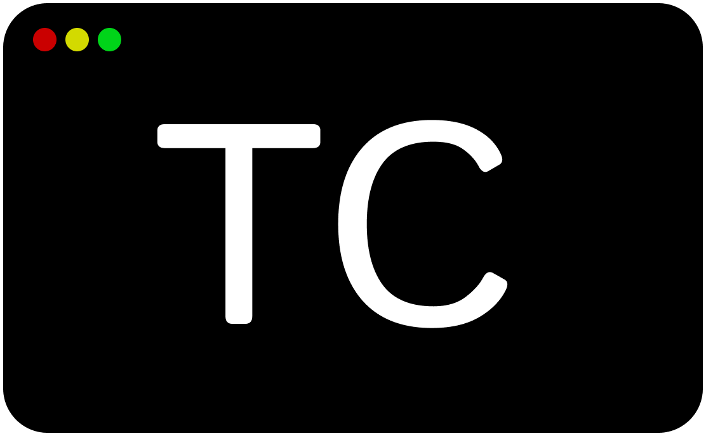

---

Termicom is a command line interpreter written by filcher in the C++ programming language. (Previously developed in Python).

# 🛠 Commands
- `help` - displays available commands
- `info` - displays information about the program
- `ls` - lists files and directories in a directory

# About the project

Termicom is a command line interpreter written by filcher in the C++ programming language. (Previously developed in Python). The first version was created on November 12, 2023 by the developer filcher. The latest version on Python was 1.0.3, November 29, 2023

# ⚖️ License
The Termikom program, all its libraries and programs are distributed under the [GNU General Public License](https://github.com/filcherock/Termicom/blob/main/LICENSE)
